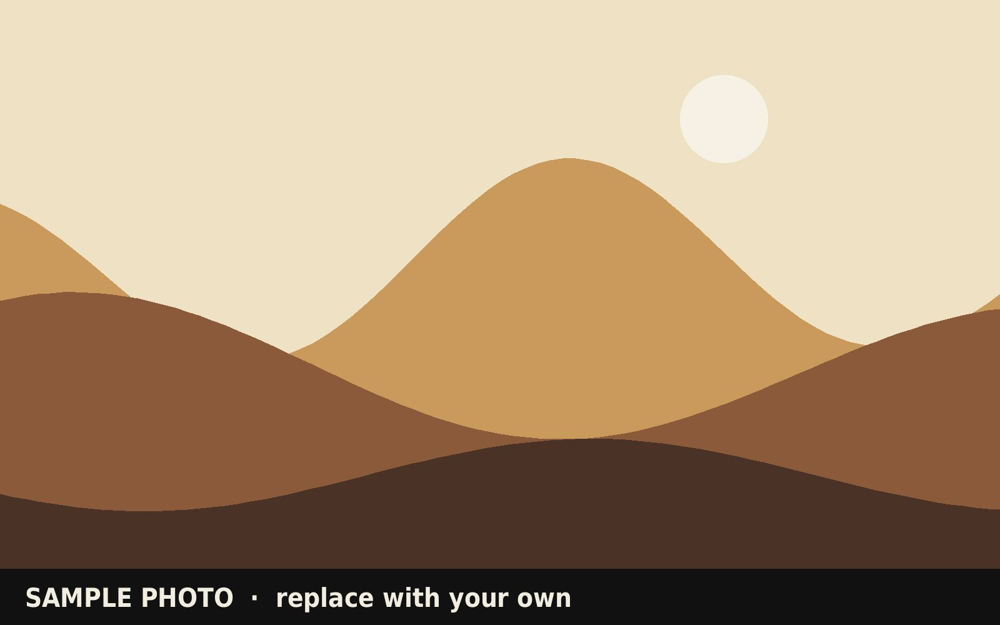

This is where the writing goes. Write in plain Markdown: paragraphs, **bold**, *italics*, [links](https://example.com), and headings.

## Day one

Each `##` heading starts a new section. Photos can also go inline:

## Day two

Delete this sample folder when you add real trips.
